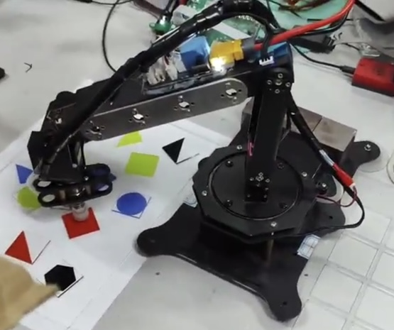
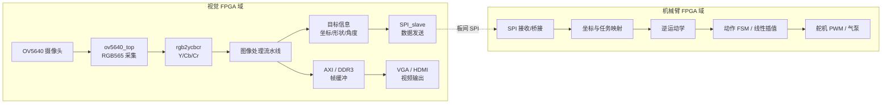
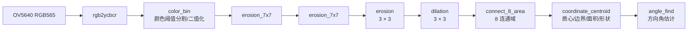
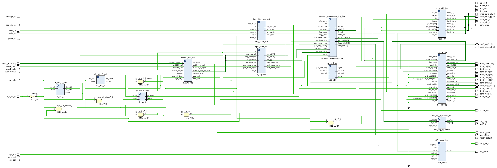

# 基于 FPGA 的视觉与机械臂分析/控制系统

一个以 FPGA RTL 为核心的实时视觉识别与机械臂控制系统，参加第九届全国大学生集成电路创新创业大赛（海云捷讯杯），并获得全国二等奖。

## 全国二等奖

**第九届全国大学生集成电路创新创业大赛（海云捷讯杯）——全国二等奖**



## 演示视频

| 比赛阶段 | 视频 |
| --- | --- |
| 初赛——难度一 | [Bilibili 演示视频](https://www.bilibili.com/video/BV1e2ybBSEzf) |
| 初赛——难度二 | [Bilibili 演示视频](https://www.bilibili.com/video/BV192ybBSESe) |
| 全国总决赛——获奖作品 | [Bilibili 演示视频](https://www.bilibili.com/video/BV1e1ybBnE92) |

## 系统概述

项目将 OV5640 摄像头采集、流式图像处理、目标特征提取、板间数据传输、机械臂坐标/运动分析、状态控制和舵机执行连接成一个竞赛作品。仓库中可以直接浏览两部分 RTL：

- 图像端：OV5640 配置与 RGB565 采集、RGB 到 Y/Cb/Cr 转换、颜色分割、形态学处理、8 连通域处理、质心/边界特征、方向角估计、AXI/DDR3 缓冲以及 VGA/HDMI 输出。
- 机械臂端：SPI、坐标映射、逆运动学候选实现、动作状态机、线性插值、舵机 PWM 和气泵/执行机构控制。

本次整理把新上传的图像处理代码从原来的 `rtl/new/` 按活动链路和备选版本重新放入可浏览目录，并将图像端顶层框图保存为 [`media/vision_top_block_diagram.png`](media/vision_top_block_diagram.png)。原始技术资料和上一轮图像端快照仍被保留。

> 说明：当前仓库是作品集和源代码快照，不宣称在缺失原始 Vivado IP、时钟配置、DDR/MIG 配置、FIFO/RAM/CORDIC 配置和完整工程文件的情况下可以单独完成全工程重建。活动链路、依赖缺口和静态 review 见 [`docs/image_processing_reaudit.md`](docs/image_processing_reaudit.md)、[`docs/repository_audit.md`](docs/repository_audit.md) 和 [`docs/rtl_review.md`](docs/rtl_review.md)。

## 系统架构

下面的系统级关系来自当前图像端顶层和仓库中的机械臂 RTL/技术文档。虚线表示两个 FPGA 设计域之间的板间关系；图像端与机械臂端在仓库中仍是两个工程快照。



## 图像处理流水线

当前重新上传的 `rtl/new/impress/connect_component_top.v` 和 `rtl/new/newbe/newbe/erosion_7x7/erosion_7x7.v` 中的实例连接，确认了以下活动图像处理顺序。整理后的活动文件位于 `rtl/vision/` 和 `rtl/top/vision/`。



顶层还把处理后的 `bin_out` 写入 AXI/DDR3 读写通路，并通过 VGA/HDMI 端口输出显示；目标信息通过图像端 `SPI_slave` 的 `Din` 路径连接到板间通信接口。按键、LED 和数码管用于当前代码中的颜色/模式/阈值调节及状态显示。



### 活动 RTL 层次

```text
ov5640_hdmi
├── ov5640_top
│   ├── i2c_ctrl
│   ├── ov5640_cfg
│   └── ov5640_data
├── key_filiter_top
│   └── key_filter × 4
├── rgb2ycbcr
├── connect_component_top
│   ├── color_bin
│   ├── erosion_7x7 × 2
│   │   └── matrix_generate_7x7_1bit
│   │       └── line_shift_ram_8bit_7x7
│   │           └── ram_8x1024 × 6 [外部生成 RAM IP]
│   ├── erosion
│   │   └── matrix_generate_3x3_1bit
│   │       └── line_shift_ram_8bit
│   │           └── ram_8x1024 × 2 [外部生成 RAM IP]
│   ├── dilation
│   ├── connect_8_area
│   │   └── fifo_640x1 [外部生成 FIFO IP]
│   ├── coordinate_centroid
│   │   └── cordic_1 × 4 [外部生成 CORDIC IP]
│   └── angle_find
│       ├── cordic_0 [外部生成 CORDIC IP]
│       └── divide_angle × 2 [外部生成除法 IP]
├── axi_ddr_top
│   ├── axi_ctrl
│   │   ├── wr_fifo [外部生成 FIFO IP]
│   │   └── rd_fifo [外部生成 FIFO IP]
│   ├── axi_master_write
│   ├── axi_master_read
│   └── axi_ddr [外部 MIG/DDR IP]
├── vga_ctrl
├── hdmi_ctrl
│   ├── encode × 3
│   └── par_to_ser × 4
└── top_seg_dynamic
    └── seg_dynamic
        └── bcd_8421
```

`clk_wiz_0`、`clk_wiz_1`、`clk_wiz_2`、`ram_8x1024`、`fifo_640x1`、`wr_fifo`、`rd_fifo`、`cordic_0`、`cordic_1`、`divide_angle` 和 `axi_ddr` 是当前源代码引用但未随新上传目录提供的工程/IP 依赖。它们没有被伪造或补写；具体时钟频率、IP latency、CDC 方案和约束需要原始工程确认。

## 硬件与 RTL 关注点

以下内容均来自当前 RTL、Quartus 配置或技术文档；没有在本次整理中添加吞吐率、FPS、资源利用率、时序频率或 latency 数字。

- **流式像素接口：** 图像模块使用帧同步、行同步、数据使能和像素数据端口在模块之间传递视频流。
- **图像窗口处理：** 3 × 3 和 7 × 7 形态学模块通过矩阵生成与行缓存组织邻域数据，并调用外部 `ram_8x1024`。
- **硬件特征计算：** `coordinate_centroid` 中可以看到像素计数、坐标累加、边界点保存和整数除法/移位等运算路径；其 CORDIC 配置不在当前仓库中。
- **硬件方向估计：** `angle_find` 连接 `cordic_0` 和 `divide_angle`，输出 9 位 `angle_data`；精度和 IP latency 未从工程配置中核实。
- **帧缓存与显示：** `axi_ddr_top` 连接 DDR3 物理接口和 AXI 用户侧读写；`vga_ctrl` 产生视频时序，`hdmi_ctrl` 通过 TMDS 编码和差分串行输出连接 HDMI。
- **板间通信：** 图像端顶层实例化 `SPI_slave`，机械臂侧保留 SPI master/slave/bridge 相关 RTL。
- **控制结构：** 机械臂侧存在状态机、模式选择、线性插值和多路舵机 PWM；具体最终使用的运动学版本仍需项目作者确认。
- **时钟域：** 源码出现摄像头像素时钟、时钟向导输出、DDR 用户时钟和机械臂侧时钟。仓库没有完整的时钟约束和 CDC 说明，因此不对 CDC 正确性作结论。

## 重点 RTL 模块

| 模块 / 源文件 | 作用 | 代码归属提示 |
| --- | --- | --- |
| [`ov5640_hdmi.v`](rtl/top/vision/ov5640_hdmi.v) | 图像端集成顶层，连接摄像头、视觉链路、SPI、AXI/DDR3、VGA/HDMI 和数码管。 | 文件含 EmbedFire/野火 header；集成部分的个人贡献待确认。 |
| [`connect_component_top.v`](rtl/top/vision/connect_component_top.v) | 连接颜色分割、7 × 7/3 × 3 形态学、8 连通域、特征提取和方向角估计。 | 未发现正面第三方作者 header；不能因此直接认定为个人原创。 |
| [`ov5640_top.v`](rtl/camera/ov5640/ov5640_top.v) | OV5640 配置、采集时序和 RGB565 数据包装。 | 文件含 EmbedFire/野火 header。 |
| [`rgb2ycbcr.v`](rtl/vision/color_space/rgb2ycbcr.v) | 将输入 RGB 分量转换为 Y/Cb/Cr，并传递视频同步信号。 | 文件含 正点原子/OpenEDV 归属说明；保留原 header。 |
| [`color_bin.v`](rtl/vision/segmentation/color_bin.v) | 按颜色模式和 Y/Cb/Cr 阈值生成二值像素流，并输出调参/状态信息。 | 可能是项目代码或适配代码，个人归属待确认。 |
| [`erosion_7x7.v`](rtl/vision/morphology/7x7/erosion_7x7.v) | 7 × 7 邻域腐蚀阶段；活动链路中使用两次。 | 依赖外部行缓存/RAM IP；个人归属待确认。 |
| [`erosion.v`](rtl/vision/morphology/erosion.v) / [`dilation.v`](rtl/vision/morphology/dilation.v) | 3 × 3 邻域腐蚀和膨胀。 | 个人归属待确认。 |
| [`connect_8_area.v`](rtl/vision/connected_components/connect_8_area.v) | 二值流的 8 连通域处理和目标区域输出。 | 依赖外部 `fifo_640x1`；个人归属待确认。 |
| [`coordinate_centroid.v`](rtl/vision/feature_extraction/coordinate_centroid.v) | 坐标/像素统计、质心、边界点、面积/形状信息和发送数据相关输出。 | 依赖 `cordic_1`；个人归属待确认。 |
| [`angle_find.v`](rtl/vision/angle_estimation/angle_find.v) | 根据提取的几何特征估计目标方向角。 | 依赖 `cordic_0` 与 `divide_angle`；个人归属待确认。 |
| [`axi_ddr_top.v`](rtl/memory/axi_ddr3/axi_ddr_top.v) | AXI/DDR3 用户侧读写和物理接口包装。 | 含 EmbedFire/野火信息并引用 MIG/IP；不是可独立编译的完整 DDR 工程。 |
| [`hdmi_ctrl.v`](rtl/display/hdmi/hdmi_ctrl.v) | HDMI 视频编码与输出控制。 | 相关文件含 EmbedFire/野火 header，并使用 Xilinx 原语。 |
| [`key_filiter_top.v`](rtl/vision/control/key_filiter_top.v) | 四路按键消抖/控制脉冲生成。 | 保留原始模块名 `filiter`，不在本轮改名。 |
| [`CICC_2025_Arm.v`](rtl/top/robotic_arm/CICC_2025_Arm.v) | 机械臂侧顶层集成。 | 工程快照中的项目/适配归属待确认。 |
| [`state_ctrl.v`](rtl/robotic_arm/control/state_ctrl.v) / [`linear_interpolation.v`](rtl/robotic_arm/control/linear_interpolation.v) | 动作状态机和舵机目标值插值。 | 项目或适配代码，个人归属待确认。 |
| [`pwm_servo_1M.v`](rtl/robotic_arm/servo/pwm_servo_1M.v) | 机械臂侧舵机 PWM 生成。 | 项目或适配代码，个人归属待确认。 |

## 我的贡献

当前 Git 历史、技术报告和源文件足以说明项目的团队成果，但不足以证明每个 RTL 文件的个人作者。为避免把参考代码或队友代码误写成个人原创，本 README 暂时使用以下保守表述：

- 项目团队完成了技术资料中描述的摄像头采集、视觉处理、存储/显示、板间通信、机械臂分析与控制系统集成。
- 没有明确第三方 header 的图像算法、控制和集成代码暂记为“可能为项目代码或适配代码”，不等同于“本人原创”。
- 个人求职版本发布前，应把下列 TODO 替换为本人可以在面试中解释并由项目记录支持的具体内容。

待项目作者补充：

- [ ] 我本人负责设计/修改的视觉 RTL 文件及模块接口：`TODO`。
- [ ] 我本人负责的 OV5640、AXI/DDR3、HDMI、时钟/IP 集成范围：`TODO`。
- [ ] 我本人负责的 SPI 数据格式、坐标映射、逆运动学、FSM、插值和 PWM 范围：`TODO`。
- [ ] 竞赛最终使用的顶层、运动学版本和完整工程/IP 文件列表：`TODO`。
- [ ] 需要致谢的队友、参考工程、第三方代码和许可证：`TODO`。

## 硬件组成

| 组成 | 当前证据 |
| --- | --- |
| 视觉 FPGA 板 | 技术文档记录为野火升腾 Mini / Artix-7 XC7A100T；具体工程器件配置仍需原始 Vivado 工程确认。 |
| 机械臂控制板 | `hardware/quartus/CICC_2025_Arm.qsf` 记录为 AWC_C4 青春版 / Cyclone IV E `EP4CE6F17C8L`。 |
| 摄像头 | OV5640；源代码包含 SCCB 配置和 RGB565 采集路径。 |
| 外部存储器 | 图像端顶层包含 DDR3 物理端口和 AXI/DDR3 用户侧包装；MIG/生成 IP 未随新上传目录提供。 |
| 视频输出 | VGA 时序、HDMI TMDS 编码和差分输出。 |
| 板间通信 | 图像端 `SPI_slave` 与机械臂侧 SPI RTL；最终板间连接方式以原始硬件工程和技术资料为准。 |
| 执行机构 | 机械臂侧源代码包含多路舵机 PWM 和气泵/执行机构控制信号。 |

## 仓库结构

```text
rtl/
├── top/vision/                  图像端当前集成顶层
├── top/robotic_arm/             机械臂侧顶层和坐标集成
├── camera/ov5640/               OV5640 配置与采集
├── vision/
│   ├── color_space/             颜色空间转换、reference 和 variants
│   ├── segmentation/            活动颜色分割与二值化候选
│   ├── morphology/              3 × 3、7 × 7 形态学与行缓存
│   ├── connected_components/    8 连通域及旧版本
│   ├── feature_extraction/      质心、边界和面积/形状特征
│   ├── angle_estimation/        方向角估计
│   ├── control/                 图像端按键控制
│   └── variants/                newbe/tiaoshi/实验和旧顶层版本
├── memory/axi_ddr3/             AXI/DDR3 用户侧包装
├── display/                     HDMI/VGA 与数码管
├── inter_board/spi/             SPI 桥接与板间通信 RTL
├── robotic_arm/                 运动学、放置、控制和舵机
└── vendor/                      已标注的厂商/生成 IP
sim/                             图像端和机械臂侧仿真文件
docs/                            审计、review、技术报告和比赛材料
media/                           语义化作品集图片和图像端框图
third_party/                     归因边界和作者归属说明
hardware/quartus/                Quartus 工程/配置快照
archive/                         原始压缩包和上一轮图像端快照
```

`rtl/vision/variants/` 中的同名模块是备选或实验版本，不能与活动版本无选择地加入同一个 Verilog file list。`archive/previous_image_processing/` 只用于版本对照和溯源，不代表当前活动实现。

## 项目文档

- [`docs/technical_report.pdf`](docs/technical_report.pdf) — 项目技术报告。
- [`docs/competition_presentation.pdf`](docs/competition_presentation.pdf) — 比赛答辩材料。
- [`docs/image_processing_reaudit.md`](docs/image_processing_reaudit.md) — 新上传图像处理代码和顶层框图的专项复审。
- [`docs/repository_audit.md`](docs/repository_audit.md) — 仓库整体审计、架构、模块和归因记录。
- [`docs/rtl_review.md`](docs/rtl_review.md) — 本轮只记录、不修复的 RTL 静态 review 项目。
- [`docs/github_metadata.md`](docs/github_metadata.md) — 推荐的 GitHub 仓库名称、简介和 topics；没有修改远程仓库 metadata。
- [`third_party/README.md`](third_party/README.md) — 第三方、reference、generated material 和作者归属边界。

## 代码归因

仓库同时包含项目 RTL、参考/适配基础设施和 FPGA 生成 IP。当前从文件 header、版权声明和实例名称确认到的范围如下：

- OV5640、图像端顶层、AXI/DDR3、HDMI、数码管和 `rgb2yuv` 等文件中保留 EmbedFire/野火信息。
- `rtl/vision/color_space/rgb2ycbcr.v` 保留 正点原子/OpenEDV 归属说明。
- [`rtl/vision/color_space/reference/VIP_RGB888_YCbCr444.v`](rtl/vision/color_space/reference/VIP_RGB888_YCbCr444.v) 保留 CrazyBingo 版权/作者说明，并单独放在 reference 目录。
- `rtl/vendor/` 中保留 Altera/Intel 生成的 wrapper、PLL/ROM/CORDIC 等材料，并保留源文件已有的法律声明。
- `axi_ddr_top.v` 和 `par_to_ser.v` 显式引用 Xilinx MIG/器件原语；对应完整生成配置不在当前可浏览源树中。
- 没有明确第三方 header 的 `color_bin`、连通域、质心、角度、形态学和机械臂控制模块只能暂记为项目代码或适配代码，不能自动声明为本人原创。

请遵守每个源文件中的 copyright notice、原始 license 和厂商 IP 使用条款。根目录 `LICENSE` 不应被理解为重新授权 vendor/reference material。

## 获奖情况

**第九届全国大学生集成电路创新创业大赛（海云捷讯杯）——全国二等奖。**
