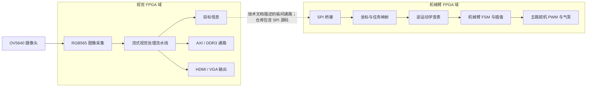

# 基于 FPGA 的视觉与机械臂系统

这是一个面向实时视觉识别与机械臂控制的纯 FPGA 系统，项目参加了第九届全国大学生集成电路创新创业大赛（海云捷讯杯）。

## 全国二等奖

本项目获得第九届全国大学生集成电路创新创业大赛 **全国二等奖**。


## 演示视频

| 比赛阶段 | 视频 |
|---|---|
| 初赛——难度一 | [Bilibili 演示视频](https://www.bilibili.com/video/BV1e2ybBSEzf) |
| 初赛——难度二 | [Bilibili 演示视频](https://www.bilibili.com/video/BV192ybBSESe) |
| 全国总决赛——获奖作品 | [Bilibili 演示视频](https://www.bilibili.com/video/BV1e1ybBnE92) |

## 系统概述

本项目将摄像头采集、流式图像处理、目标特征提取、板间数据传输、坐标转换、逆运动学查表、状态控制和舵机执行结合在一起。技术文档描述了一个双 FPGA 板系统：基于 Artix-7 的图像/视觉处理端，以及基于 AWC_C4 / Cyclone IV 的机械臂控制端。

当前仓库同时保留了两个设计域的源代码快照。可浏览的图像端顶层主要包括 OV5640 采集、图像处理、DDR3/AXI 缓冲以及 HDMI/VGA 显示；归档的 Quartus 机械臂工程包括机械臂侧 SPI、坐标处理、运动学、FSM、插值和 PWM 控制逻辑。由于部分时钟、存储器、FIFO 以及工程文件属于外部生成文件或在快照中缺失，当前仓库不宣称可以单独完成完整的跨板工程重建。详细情况请参阅 [`docs/repository_audit.md`](docs/repository_audit.md) 和 [`docs/rtl_review.md`](docs/rtl_review.md)。

## 系统架构



虚线表示技术文档和项目结构中描述的两个 FPGA 域之间的关系。当前仓库中的图像端顶层与归档的机械臂 Quartus 顶层是两个独立的工程快照，并不是一个已经验证可以整体编译的单一顶层工程。

## 视觉处理流水线

[`rtl/top/vision/connect_component_top.v`](rtl/top/vision/connect_component_top.v) 中可以直接看到如下图像处理顺序：


实际 RTL 数据通路通过帧同步、行同步和数据使能信号传递。图像端顶层还将处理后的视频流连接到 AXI/DDR3 包装模块以及 VGA/HDMI 输出通路。

## 硬件架构

以下硬件和设计机制均可以从 RTL、工程文件或技术文档中得到证据：

- **视觉处理板：** 技术文档中记录的野火升腾 Mini / Artix-7 XC7A100T。
- **机械臂控制板：** [Quartus 工程配置](hardware/quartus/CICC_2025_Arm.qsf) 中记录的 AWC_C4 青春版 / Cyclone IV E `EP4CE6F17C8L`。
- **摄像头：** OV5640，包含 SCCB/I2C 风格配置和 RGB565 采集逻辑。
- **流式像素处理：** valid、line、frame 等时序信号经过颜色空间转换、分割、形态学处理、连通域处理和特征提取阶段。
- **存储与显示：** 图像端快照中存在 AXI 风格 DDR3 包装模块、生成的 MIG 依赖、VGA 时序、TMDS 编码和 HDMI 差分串行输出。
- **板间通信：** 机械臂工程快照中存在 SPI master/slave/bridge RTL 以及 32-bit arm-side 事务结构。
- **硬件数学运算：** 机械臂侧代码中存在整数/移位运算、除法/开方/CORDIC 相关 IP、ROM 查表和坐标映射。具体定点格式和精度没有在当前仓库元数据中明确记录。
- **控制逻辑：** 存在明确的机械臂状态机、模式选择、线性插值、复位/锁定控制、五路舵机 PWM 和气泵控制。
- **时钟域：** 源码中可以看到摄像头像素时钟、图像端生成时钟、DDR 用户时钟和机械臂侧时钟。当前仓库不包含完整的 CDC 方案说明和时序报告。

本 README 不宣称任何 throughput、FPS、latency、资源利用率、时钟频率或 CDC 正确性数字。技术文档中出现的竞赛测试数据仍保留在原始技术报告中，但没有在本次整理中独立复现。

## 重点 RTL 模块

| 模块 / 源文件 | 作用 | 归属说明 |
|---|---|---|
| [`ov5640_hdmi.v`](rtl/top/vision/ov5640_hdmi.v) | 图像端摄像头、视觉处理、DDR3/AXI 和 HDMI/VGA 通路的集成顶层。 | 含 EmbedFire reference header；集成部分的具体归属需要确认。 |
| [`ov5640_top.v`](rtl/camera/ov5640/ov5640_top.v) | OV5640 配置与像素采集包装模块。 | 含 EmbedFire / 野火 header。 |
| [`connect_component_top.v`](rtl/top/vision/connect_component_top.v) | 连接分割、形态学、连通域、质心/特征提取和角度估计。 | 可能属于项目代码或适配代码；需要确认具体贡献者。 |
| [`binarization.v`](rtl/vision/segmentation/binarization.v) | 基于 Y/Cb/Cr 的颜色阈值分割和二值流生成。 | 可能属于项目代码或适配代码；需要确认具体贡献者。 |
| [`erosion.v`](rtl/vision/morphology/erosion.v) 与 [`dilation.v`](rtl/vision/morphology/dilation.v) | 3 × 3 邻域形态学处理阶段。 | 可能属于适配代码或项目代码；需要确认具体贡献者。 |
| [`connect_8_area.v`](rtl/vision/connected_components/connect_8_area.v) | 8 连通域标记与目标选择逻辑。 | 可能属于项目代码或适配代码；需要确认具体贡献者。 |
| [`coordinate_centroid.v`](rtl/vision/feature_extraction/coordinate_centroid.v) | 坐标累加、质心/最高点信息、基于面积的形状信息和控制标志。 | 可能属于项目代码或适配代码；需要确认具体贡献者。 |
| [`angle_find.v`](rtl/vision/angle_estimation/angle_find.v) | 根据提取的特征坐标估计目标方向角。 | 可能属于项目代码或适配代码；需要确认具体贡献者。 |
| [`CICC_2025_Arm.v`](rtl/top/robotic_arm/CICC_2025_Arm.v) | Cyclone IV 机械臂侧的顶层集成。 | 可能属于项目集成代码；需要确认具体贡献者。 |
| [`send_location.v`](rtl/top/robotic_arm/send_location.v) | 机械臂侧坐标映射、目标位置序列和数据有效/启动控制。 | 可能属于项目代码或适配代码；需要确认具体贡献者。 |
| [`inverse_kinematics_time.v`](rtl/robotic_arm/kinematics/inverse_kinematics_time.v) | 基于时序/整数运算的坐标到 ROM 地址计算路径。 | 工程快照同时包含 CORDIC 版本，最终使用版本需要确认。 |
| [`state_ctrl.v`](rtl/robotic_arm/control/state_ctrl.v) 与 [`linear_interpolation.v`](rtl/robotic_arm/control/linear_interpolation.v) | 机械臂动作序列 FSM 和舵机目标值的逐步变化。 | 可能属于项目代码或适配代码；需要确认具体贡献者。 |
| [`pwm_servo_1M.v`](rtl/robotic_arm/servo/pwm_servo_1M.v) | 机械臂侧控制时钟下的舵机 PWM 生成。 | 可能属于项目代码或适配代码；需要确认具体贡献者。 |

## 我的贡献

当前仓库的 Git 提交作者为 `Hanwen Zhang`，但 Git 元数据本身不能证明每个文件的个人作者。技术文档呈现的是团队级工作，而且部分源文件带有第三方/reference header。因此，本节先采用保守表述：

- 项目团队完成了技术文档中描述的摄像头、视觉处理、存储/显示、板间通信、机械臂分析和控制子系统集成。
- `rtl/vision/`、`rtl/inter_board/` 和 `rtl/robotic_arm/` 中没有明确第三方 header 的文件，可能属于项目代码或适配代码，但当前仓库无法证明具体的个人归属。

在把仓库作为个人作品集公开使用前，请补充以下信息：

- [ ] 确认我本人具体设计或修改过哪些视觉 RTL 模块。
- [ ] 确认我是否负责 OV5640/HDMI/DDR3 reference integration，以及具体适配范围。
- [ ] 确认我是否负责 SPI 数据包格式、坐标映射、逆运动学查表、FSM/插值和 PWM 控制。
- [ ] 确认需要致谢的队友、外部参考代码或其他第三方来源。
- [ ] 确认比赛最终使用的 inverse-kinematics 实现和完整工程文件集合。

## 硬件组成

| 组成 | 仓库中的证据 |
|---|---|
| 视觉 FPGA 板 | 技术文档中的野火升腾 Mini / XC7A100T。 |
| 机械臂 FPGA 板 | Quartus 工程快照中的 AWC_C4 青春版 / Cyclone IV E `EP4CE6F17C8L`。 |
| 摄像头 | OV5640。 |
| 外部存储器 | 图像端带 AXI 风格用户包装模块的 DDR3 通路。 |
| 显示输出 | VGA 时序和 HDMI TMDS 输出模块。 |
| 板间通信 | 技术文档描述的两个 FPGA 域之间的 SPI bridge。 |
| 执行机构 | 五路舵机 PWM 输出和一路气泵控制输出。 |
| 机械系统 | 技术文档中描述的机械臂套件；文档记录为改造后的众灵科技机械臂套件。 |

## 仓库结构

```text
rtl/
├── top/vision/                  图像端集成
├── top/robotic_arm/             机械臂侧顶层和坐标集成
├── camera/ov5640/               摄像头配置与采集
├── vision/                      颜色、分割、形态学、特征和角度处理
├── memory/axi_ddr3/             AXI/DDR3 用户侧包装模块
├── display/hdmi/                VGA/HDMI 时序和串行化
├── inter_board/spi/             SPI 桥接 RTL
├── robotic_arm/                 运动学、放置、控制和舵机
└── vendor/                      明确标注的 generated/reference IP
sim/                             视觉端和机械臂侧 testbench
docs/                            审计、review、技术报告和答辩材料
media/                           具有语义化名称的作品集图片
third_party/                     归因边界和作者归属说明
hardware/quartus/                Quartus 工程/配置快照
archive/                         未改变的原始 CICC_2025_Arm.zip
```

## 项目文档

- [`docs/technical_report.pdf`](docs/technical_report.pdf) — 技术报告。
- [`docs/competition_presentation.pdf`](docs/competition_presentation.pdf) — 比赛答辩 PPT。
- [`docs/repository_audit.md`](docs/repository_audit.md) — 基于实际文件的仓库审计和架构清单。
- [`docs/rtl_review.md`](docs/rtl_review.md) — 本轮整理中记录但未修复的静态 RTL review 项目。
- [`docs/github_metadata.md`](docs/github_metadata.md) — 建议的仓库名称、简介和 topics；没有修改远程 metadata。
- [`third_party/README.md`](third_party/README.md) — 代码归因和作者归属边界。

## 代码归因

本仓库同时包含项目 RTL、适配/reference infrastructure 和 FPGA generated IP：

- OV5640、AXI/DDR3、HDMI 以及相关图像端集成代码中存在 EmbedFire / 野火 header。
- 颜色空间转换代码中存在 CrazyBingo 和 正点原子 / OpenedV 归属说明。
- Intel/Altera generated wrapper 和配置文件保存在 `rtl/vendor/` 下，并保留源文件中已有的法律声明。
- 完整的原始工程快照保存在 [`archive/CICC_2025_Arm.zip`](archive/CICC_2025_Arm.zip)。

请遵守原始 copyright notice 和 license。根目录 MIT license 不应被解释为重新授权其中的 vendor 或第三方材料。

## 获奖情况

**第九届全国大学生集成电路创新创业大赛（海云捷讯杯）——全国二等奖。**
