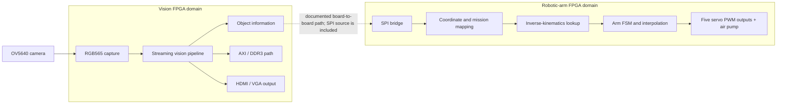
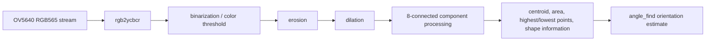

# FPGA Vision-Based Robotic Arm System

Pure-FPGA real-time vision and robotic-arm control system developed for the 9th China IC Innovation & Entrepreneurship Competition (第九届全国大学生集成电路创新创业大赛 · 海云捷讯杯).

## National Second Prize

The project received the **National Second Prize** in the 9th China IC Innovation & Entrepreneurship Competition.


## Demo

| Stage | Video |
|---|---|
| Preliminary round — difficulty level 1 | [Bilibili demo](https://www.bilibili.com/video/BV1e2ybBSEzf) |
| Preliminary round — difficulty level 2 | [Bilibili demo](https://www.bilibili.com/video/BV192ybBSESe) |
| National finals — award-winning work | [Bilibili demo](https://www.bilibili.com/video/BV1e1ybBnE92) |

## System Overview

The project combines camera capture, streaming image processing, object-feature extraction, cross-board data transfer, coordinate conversion, inverse-kinematics lookup, state sequencing, and servo actuation. The technical report describes a two-board system: an Artix-7 image/vision side and an AWC_C4 / Cyclone IV arm-control side.

The repository contains both domains as source snapshots. The visible image-side top currently focuses on OV5640 capture, processing, DDR3/AXI buffering, and HDMI/VGA display. The archived Quartus arm project contains the arm-side SPI, coordinate, kinematics, FSM, interpolation, and PWM logic. The complete cross-board build is not claimed to be reproducible from the repository alone because generated clock, memory, FIFO, and some project files are external or missing; see [`docs/repository_audit.md`](docs/repository_audit.md) and [`docs/rtl_review.md`](docs/rtl_review.md).

## System Architecture



The dashed connection represents the documented/project-level relationship between the two FPGA domains. The current tracked image-side top and the archived arm-side Quartus top are separate build snapshots rather than one verified monolithic top-level design.

## Vision Pipeline

The active image-processing hierarchy in [`rtl/top/vision/connect_component_top.v`](rtl/top/vision/connect_component_top.v) exposes the following order:



The exact RTL data path is implemented through frame-valid, line-valid, and data-enable signals. The image-side top also connects the processed stream to an AXI/DDR3 wrapper and a VGA/HDMI output path.

## Hardware Architecture

The following hardware and design mechanisms are evidenced by the RTL, project files, or technical documents:

- **Vision board:** Wildfire ShengTeng Mini / Artix-7 XC7A100T as identified in the technical report.
- **Arm board:** AWC_C4 青春版 / Cyclone IV E `EP4CE6F17C8L` according to [`hardware/quartus/CICC_2025_Arm.qsf`](hardware/quartus/CICC_2025_Arm.qsf).
- **Camera:** OV5640 with SCCB/I2C-style configuration and RGB565 capture logic.
- **Streaming pixel processing:** valid/line/frame timing signals pass through color conversion, segmentation, morphology, connected-component processing, and feature extraction stages.
- **Memory and display:** an AXI-style DDR3 wrapper, generated-MIG dependency, VGA timing, TMDS encoding, and differential HDMI serialization are present in the image-side snapshot.
- **Board-to-board communication:** SPI master/slave/bridge RTL and a 32-bit arm-side transaction structure are present in the arm project snapshot.
- **Hardware arithmetic:** integer/shift-based arithmetic, divider/square-root/CORDIC-related IP, ROM lookup tables, and coordinate mapping are present in the arm-side source. The exact fixed-point formats and precision are not documented as metadata here.
- **Control logic:** an explicit arm state machine, mode selection, linear interpolation, reset/lock gating, and five servo PWM channels plus air-pump control are present.
- **Clock domains:** camera pixel, generated image, DDR user, and arm-side clock signals are visible in the sources. A complete CDC scheme and timing report are not included in this repository snapshot.

No throughput, FPS, latency, resource-utilization, timing-frequency, or CDC-correctness number is claimed in this README. Reported competition-document measurements remain in the original technical report and have not been independently reproduced as part of this organization pass.

## Key RTL Modules

| Module / source | Function | Attribution status |
|---|---|---|
| [`ov5640_hdmi.v`](rtl/top/vision/ov5640_hdmi.v) | Image-side integration of camera, vision, DDR3/AXI, and HDMI/VGA paths. | Contains EmbedFire reference header; integration ownership requires confirmation. |
| [`ov5640_top.v`](rtl/camera/ov5640/ov5640_top.v) | OV5640 configuration and pixel-capture wrapper. | EmbedFire / 野火 header. |
| [`connect_component_top.v`](rtl/top/vision/connect_component_top.v) | Connects segmentation, morphology, connected components, centroid/feature extraction, and angle estimation. | Probable project-specific/adapted; owner confirmation required. |
| [`binarization.v`](rtl/vision/segmentation/binarization.v) | Color-dependent Y/Cb/Cr thresholding and binary stream generation. | Probable project-specific/adapted; owner confirmation required. |
| [`erosion.v`](rtl/vision/morphology/erosion.v) and [`dilation.v`](rtl/vision/morphology/dilation.v) | 3 × 3 neighborhood morphology stages. | Probable adapted/project-specific; owner confirmation required. |
| [`connect_8_area.v`](rtl/vision/connected_components/connect_8_area.v) | 8-connected component labeling/selection logic. | Probable project-specific/adapted; owner confirmation required. |
| [`coordinate_centroid.v`](rtl/vision/feature_extraction/coordinate_centroid.v) | Coordinate accumulation, centroid/highest-point information, area-based shape information, and control flags. | Probable project-specific/adapted; owner confirmation required. |
| [`angle_find.v`](rtl/vision/angle_estimation/angle_find.v) | Orientation/angle estimation from extracted feature coordinates. | Probable project-specific/adapted; owner confirmation required. |
| [`CICC_2025_Arm.v`](rtl/top/robotic_arm/CICC_2025_Arm.v) | Cyclone IV arm-side top-level integration. | Probable project-specific integration; owner confirmation required. |
| [`send_location.v`](rtl/top/robotic_arm/send_location.v) | Arm-side coordinate mapping, destination sequencing, and data-valid/start control. | Probable project-specific/adapted; owner confirmation required. |
| [`inverse_kinematics_time.v`](rtl/robotic_arm/kinematics/inverse_kinematics_time.v) | Time-based/integer coordinate-to-ROM-address calculation path. | Project snapshot contains this and a CORDIC alternative; active choice needs confirmation. |
| [`state_ctrl.v`](rtl/robotic_arm/control/state_ctrl.v) and [`linear_interpolation.v`](rtl/robotic_arm/control/linear_interpolation.v) | Arm sequence FSM and stepwise servo target transition. | Probable project-specific/adapted; owner confirmation required. |
| [`pwm_servo_1M.v`](rtl/robotic_arm/servo/pwm_servo_1M.v) | Servo PWM generation at the arm-side control clock. | Probable project-specific/adapted; owner confirmation required. |

## My Contributions

The repository history is authored by `Hanwen Zhang`, but Git metadata alone does not establish file-level authorship. The technical report presents team-level work, and several source files carry third-party/reference headers. The following contribution statement is therefore intentionally conservative:

- The project team integrated the camera, vision, memory/display, board-to-board communication, robotic-arm analysis, and control subsystems described in the technical report.
- The files without explicit third-party headers in `rtl/vision/`, `rtl/inter_board/`, and `rtl/robotic_arm/` are probable project-specific or adapted project code, but the exact individual ownership is not proven by this repository.

Before using this repository as a personal portfolio, fill in these TODOs:

- [ ] Confirm which vision RTL modules I personally designed or modified.
- [ ] Confirm whether my work included the OV5640/HDMI/DDR3 reference integration and identify the extent of adaptation.
- [ ] Confirm my responsibility for SPI packet format, coordinate mapping, inverse-kinematics lookup, FSM/interpolation, and PWM control.
- [ ] Identify any additional teammates or external references whose contribution/license should be credited.
- [ ] Confirm the active inverse-kinematics implementation and the exact build/project file set used in the competition.

## Hardware

| Component | Evidence in repository |
|---|---|
| Vision FPGA board | Wildfire ShengTeng Mini / XC7A100T in the technical report. |
| Arm FPGA board | AWC_C4 青春版 / Cyclone IV E `EP4CE6F17C8L` in the Quartus project snapshot. |
| Camera | OV5640. |
| External memory | DDR3 path with AXI-style user wrapper on the image side. |
| Display | VGA timing and HDMI TMDS output modules. |
| Communication | SPI bridge between the documented FPGA domains. |
| Actuation | Five servo PWM outputs and an air-pump control output. |
| Mechanical system | Robotic arm kit described in the technical report; the report identifies a modified 众灵科技 arm kit. |

## Repository Structure

```text
rtl/
├── top/vision/                  image-side integration
├── top/robotic_arm/             arm-side top-level and coordinate integration
├── camera/ov5640/               camera configuration/capture
├── vision/                      color, segmentation, morphology, features, angle
├── memory/axi_ddr3/             AXI/DDR3 user-side wrapper
├── display/hdmi/                VGA/HDMI timing and serialization
├── inter_board/spi/             SPI bridge RTL
├── robotic_arm/                 kinematics, placement, control, servo
└── vendor/                      generated/reference IP, clearly labeled
sim/                             vision and arm-side testbenches
docs/                            audit, review notes, technical report, slides
media/                           semantic portfolio images
third_party/                     attribution boundaries and ownership notes
hardware/quartus/                small Quartus project/configuration snapshot
archive/                         unchanged original CICC_2025_Arm.zip
```

## Documentation

- [`docs/technical_report.pdf`](docs/technical_report.pdf) — technical report / 技术文档.
- [`docs/competition_presentation.pdf`](docs/competition_presentation.pdf) — competition presentation / 答辩 PPT.
- [`docs/repository_audit.md`](docs/repository_audit.md) — evidence-based repository audit and architecture inventory.
- [`docs/rtl_review.md`](docs/rtl_review.md) — static review findings deliberately left unfixed in this organization pass.
- [`docs/github_metadata.md`](docs/github_metadata.md) — proposed repository name, description, and topics; no remote metadata was changed.
- [`third_party/README.md`](third_party/README.md) — attribution and authorship boundaries.

## Code Attribution

The repository contains a mixture of project-specific RTL, adapted/reference infrastructure, and generated FPGA IP:

- EmbedFire / 野火 headers are present in the OV5640, AXI/DDR3, HDMI, and related image-side integration sources.
- CrazyBingo and 正点原子 / OpenedV notices are present in the color-space conversion sources.
- Intel/Altera generated wrappers and configuration are kept under `rtl/vendor/` and retain their original legal headers where supplied.
- The original full project snapshot is preserved under [`archive/CICC_2025_Arm.zip`](archive/CICC_2025_Arm.zip).

Please respect the original copyright notices and licenses. The root MIT license should not be interpreted as relicensing embedded vendor or third-party material.

## Award

**9th China IC Innovation & Entrepreneurship Competition (第九届全国大学生集成电路创新创业大赛 · 海云捷讯杯) — National Second Prize.**
