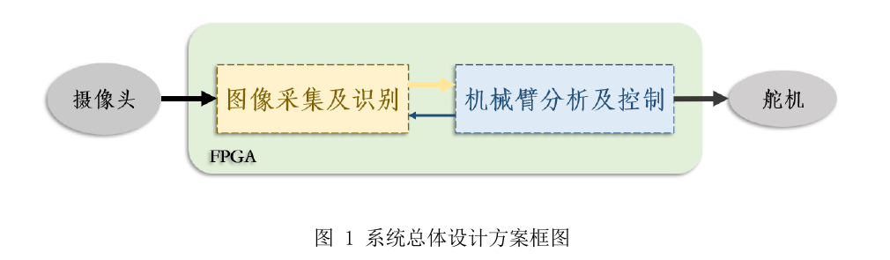
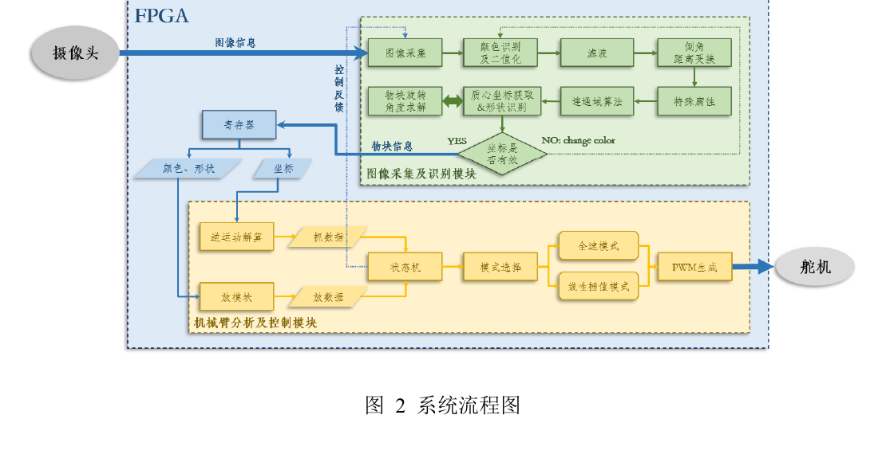

# 仓库完整审计报告

**仓库：** `WangBaren02/Image-acquisition-and-recognition-robotic-arm-analysis-and-control-system-based-on-FPGA`
**审计日期：** 2026-09-09
**审计对象：** 当前 Git 工作树、历史整理后的图像端/机械臂端 RTL、新上传的图像处理代码和 `VIP_TOP.png`、技术报告、比赛 PPT、`CICC_2025_Arm.zip`、vendor/generated material。
**审计原则：** 先核实文件和实例连接，再做目录、文档和展示整理；本轮不修改 RTL 功能行为，不删除原始技术资料，不把未确认的代码写成个人原创。

## 1. 当前仓库结构

```text
.
├── README.md
├── LICENSE
├── .gitignore / .gitattributes
├── rtl/
│   ├── top/
│   │   ├── vision/                       图像端当前顶层和旧顶层 variant
│   │   └── robotic_arm/                  机械臂侧顶层
│   ├── camera/ov5640/                    OV5640 配置与采集
│   ├── vision/
│   │   ├── color_space/                  颜色空间、reference、转换候选
│   │   ├── segmentation/                活动颜色分割与二值化候选
│   │   ├── morphology/                  3 × 3、7 × 7 形态学和行缓存
│   │   ├── connected_components/        8 连通域和 variant
│   │   ├── feature_extraction/          质心/边界/面积/形状
│   │   ├── angle_estimation/            方向角估计
│   │   ├── control/                     图像端按键控制
│   │   └── variants/                    newbe/tiaoshi 实验版本
│   ├── memory/axi_ddr3/                 AXI/DDR3 用户侧包装
│   ├── display/hdmi/                    VGA/HDMI
│   ├── display/seven_segment/           数码管显示
│   ├── inter_board/spi/                 板间 SPI
│   ├── robotic_arm/                    运动学、放置、控制、舵机
│   └── vendor/                          已标注的厂商/生成 IP
├── sim/
│   ├── vision/                          图像端仿真文件
│   └── robotic_arm/                    机械臂侧 testbench
├── hardware/quartus/                   Quartus 项目/配置快照
├── docs/                               审计、review、技术报告和 PPT
├── media/                              系统照片和图像端框图
├── third_party/                        归因边界说明
└── archive/
    ├── CICC_2025_Arm.zip               原始机械臂工程压缩包
    └── previous_image_processing/      上一轮图像端快照
```

新上传的 `rtl/new/` 已经整理完成，最终树中不再保留含义不清的 `new/` 活动目录。`archive/previous_image_processing/` 和 `archive/CICC_2025_Arm.zip` 用于版本对照和溯源，不作为当前活动工程的无选择 file list。

## 2. 系统架构

从技术报告、当前图像端顶层、机械臂侧顶层和 SPI 文件可以确认这是两个 FPGA 设计域组成的系统快照：

审计报告引用技术报告中的原始框图作为系统架构证据，不对流程图进行重新绘制。图 1 给出两个 FPGA 功能模块的顶层边界，图 2 给出视觉处理、机械臂控制和执行机构之间的流程关系。





来源：[`docs/technical_report.pdf`](technical_report.pdf)，第 5 页图 1、第 10 页图 2。

图像端当前顶层 `ov5640_hdmi` 本身没有实例化机械臂端顶层；机械臂端 `CICC_2025_Arm` 也不是图像端顶层的子模块。因此上图表达的是技术资料和跨板 SPI RTL 所支持的系统关系，不是一个已经验证可以整体编译的单一 Verilog top。

## 3. 图像端当前活动 RTL 层次

当前候选顶层为 [`rtl/top/vision/ov5640_hdmi.v`](../rtl/top/vision/ov5640_hdmi.v)，其可见实例关系如下：

```text
ov5640_hdmi
├── SPI_slave
├── clk_wiz_0                    外部生成时钟 IP，源码未提供
├── clk_wiz_1                    外部生成时钟 IP，源码未提供
├── clk_wiz_2                    外部生成时钟 IP，源码未提供
├── ov5640_top
│   ├── i2c_ctrl
│   ├── ov5640_cfg
│   └── ov5640_data
├── key_filiter_top
│   └── key_filter × 4
├── rgb2ycbcr
├── connect_component_top
│   ├── color_bin
│   ├── erosion_7x7 × 2
│   │   └── matrix_generate_7x7_1bit
│   │       └── line_shift_ram_8bit_7x7
│   │           └── ram_8x1024 × 6   外部生成 RAM IP
│   ├── erosion
│   │   └── matrix_generate_3x3_1bit
│   │       └── line_shift_ram_8bit
│   │           └── ram_8x1024 × 2   外部生成 RAM IP
│   ├── dilation
│   ├── connect_8_area
│   │   └── fifo_640x1               外部生成 FIFO IP
│   ├── coordinate_centroid
│   │   └── cordic_1 × 4             外部生成 CORDIC IP
│   └── angle_find
│       ├── cordic_0                 外部生成 CORDIC IP
│       └── divide_angle × 2         外部生成除法 IP
├── top_seg_dynamic
│   └── seg_dynamic
│       └── bcd_8421
├── axi_ddr_top
│   ├── axi_ctrl
│   │   ├── wr_fifo                   外部生成 FIFO IP
│   │   └── rd_fifo                   外部生成 FIFO IP
│   ├── axi_master_write
│   ├── axi_master_read
│   └── axi_ddr                       外部 MIG/DDR IP
├── vga_ctrl
└── hdmi_ctrl
    ├── encode × 3
    └── par_to_ser × 4
        ├── ODDR2
        └── OBUFDS
```

## 4. 图像处理流水线

当前 `connect_component_top.v` 中直接连接的处理顺序是：

```text
OV5640 RGB565
  → rgb2ycbcr
  → color_bin（颜色阈值分割/二值化）
  → erosion_7x7
  → erosion_7x7
  → erosion（3 × 3）
  → dilation（3 × 3）
  → connect_8_area（8 连通域）
  → coordinate_centroid（质心/边界/面积/形状）
  → angle_find（方向角）
```

### 主要模块作用

| 模块 | 作用 |
| --- | --- |
| `ov5640_top` | OV5640 配置、像素时序和 RGB565 数据输出。 |
| `rgb2ycbcr` | RGB 分量到 Y/Cb/Cr 的流式转换，并传递帧/行/数据使能。 |
| `color_bin` | 根据颜色模式和 Y/Cb/Cr 阈值生成二值像素流，同时输出调参/状态信号。 |
| `erosion_7x7` | 7 × 7 窗口腐蚀，当前活动链路中使用两次。 |
| `erosion` / `dilation` | 3 × 3 窗口腐蚀和膨胀。 |
| `connect_8_area` | 二值流的 8 连通域处理、标签/行缓存和目标区域输出。 |
| `coordinate_centroid` | 像素计数、坐标累加、质心、最高/最低点、面积和形状相关信息。 |
| `angle_find` | 使用特征坐标、CORDIC/除法 IP 和分段算术生成 `angle_data`。 |
| `axi_ddr_top` | AXI 用户侧读写、DDR3 物理接口和帧缓存连接。 |
| `vga_ctrl` / `hdmi_ctrl` | VGA 时序、TMDS 编码、差分串行化和 HDMI 输出。 |
| `top_seg_dynamic` | 将调试/状态数据转换为数码管动态扫描输出。 |

新框图已保存为 [`media/vision_top_block_diagram.png`](../media/vision_top_block_diagram.png)，图像内容和 hash 保持不变。

## 5. 机械臂端 RTL 结构

机械臂端顶层 [`rtl/top/robotic_arm/CICC_2025_Arm.v`](../rtl/top/robotic_arm/CICC_2025_Arm.v) 的可见结构为：

```text
CICC_2025_Arm
├── pll_ip                         外部/生成 PLL IP
├── key × 3 / key_1M × 2
├── SPI_Shengteng
│   └── SPI_master
├── send_location
└── robotic_arm_low_clk
    ├── catch
    │   ├── inverse_kinematics_cordic
    │   └── rom_catch_data
    ├── laydown
    ├── state_ctrl
    ├── mode_select
    ├── linear_interpolation
    └── pwm_servo_1M × 5
```

机械臂端源码实际出现了 `SPI_Shengteng` 对 32-bit 数据的打包/解包、坐标输入、形状/颜色输入、逆运动学候选、状态控制、插值和五路 PWM/气泵输出。技术资料和 QSF 还表明这是一个 Cyclone IV 侧工程快照；完整原始 Quartus 工程仍以 ZIP 为准。

## 6. `CICC_2025_Arm.zip` 内容

原始压缩包保留在 [`archive/CICC_2025_Arm.zip`](../archive/CICC_2025_Arm.zip)，未修改。检查到的内容类型包括：

- Quartus 17.1 项目文件、QSF/QPF/QWS 和原始相对路径配置；
- 机械臂侧顶层、坐标、SPI、运动学、放置、状态控制、插值、按键和舵机 RTL；
- Intel/Altera PLL、ROM、CORDIC/除法/开方等生成 IP 或 wrapper；
- ModelSim/Quartus 数据库、波形、报告、编译输出、备份 RTL 和其他工程中间文件；
- `atan2.qsys`、`atan2.sopcinfo` 等组件描述文件。

从 QSF 直接确认：family 为 `Cyclone IV E`，device 为 `EP4CE6F17C8L`，顶层实体为 `CICC_2025_Arm`。QSF 中仍引用缺失的 `rtl/Top/CICC_2025_Arm_prime.v` 和 `rtl/arm/catch/inverse_kinematics.v`，因此从 ZIP 提取的可浏览子集不能宣称是完整可编译工程。可浏览的源代码已经整理到 `rtl/`；生成数据库、编程文件、报告、波形和 `.bak` 等不进入活动源树。

## 7. 第三方/reference/generated 分类

### 明确的第三方或厂商材料

| 范围 | 证据与分类 |
| --- | --- |
| `rtl/camera/ov5640/`、图像端顶层 | 文件头包含 `Author: EmbedFire`、野火平台说明和相关网址；归为 EmbedFire/野火参考或适配基础设施。 |
| `rtl/memory/axi_ddr3/` | 文件头包含 EmbedFire/野火信息；`axi_ddr_top` 引用 Xilinx MIG/AXI IP；归为参考/适配包装和外部 IP 依赖。 |
| `rtl/display/hdmi/`、`rtl/display/seven_segment/` | 新上传源文件保留 EmbedFire/野火信息；归为参考/适配显示基础设施。 |
| `rtl/vision/color_space/rgb2ycbcr.v` | 文件头包含 正点原子/OpenEDV 支持和版权文字；归为第三方参考/适配代码。 |
| `rtl/vision/color_space/reference/VIP_RGB888_YCbCr444.v` | 文件内含 CrazyBingo Corporation copyright、author 和授权说明；归为第三方 reference。 |
| `rtl/vendor/altera_ip/`、`rtl/vendor/intel_ip/` | 包含 Altera/Intel 生成 wrapper、PLL/ROM/CORDIC 等材料；保留原法律声明。 |
| `rtl/display/hdmi/par_to_ser.v` | 使用 Xilinx `ODDR2`、`OBUFDS` 原语；属于器件/IP 依赖，不代表完整生成工程已纳入。 |

### 可能属于项目代码或适配代码，但个人作者未确认

`color_bin`、活动连通域、质心、角度、3 × 3/7 × 7 形态学、按键控制、`connect_component_top`、机械臂坐标/控制和 SPI 项目连接代码没有足够的文件级证据证明当前仓库所有者本人独立原创。它们只能标记为“可能为项目代码或适配代码”。README 中保留了待作者填写的个人贡献 TODO。

## 8. 备选版本、重复文件和生成物

- `rtl/vision/variants/newbe/`：保留 `connect_component_top` 和更多注释实验内容。
- `rtl/vision/variants/tiaoshi/`：保留调试/阈值调整版 `color_bin`、`key_filiter_top`。
- `rtl/top/vision/variants/ov5640_hdmi_3.v`：保留同名的旧/简化顶层。
- `rtl/vision/segmentation/variants/binarization.v`：保留未进入活动链路的二值化候选。
- `rtl/vision/color_space/variants/rgb2yuv.v`：保留未启用的颜色转换候选。
- `rtl/vision/connected_components/variants/impress_erosion/connect_8_area.v`：保留另一份同名连通域实现。
- `rtl/vision/morphology/variants/7x7/dilation_7x7.v`：保留未进入当前链路的 7 × 7 膨胀候选。

在确认以下内容为重复或生成物后没有纳入最终活动树：

1. 新上传 `SPI_slave.v` 与现有 `rtl/inter_board/spi/SPI_slave.v` 内容等价，保留单一公共实现。
2. 新上传 Altera `Line_Shift_RAM_1Bit.v` 与 `rtl/vendor/altera_ip/Line_Shift_RAM_1Bit.v` 字节级重复，保留已标注 vendor 版本。
3. 新上传 `tiaoshi/key_filter.v` 与活动 `key_filter.v` 内容等价，不重复保留。
4. `xsim.dir/work/*.sdb`、`work.rlx`、`xvlog.log`、`xvlog.pb` 是 XSim/XVlog 生成物，不进入活动 Git 源树。

原始 ZIP 未修改，因此重复排除不会使原始工程快照失去溯源来源。

## 9. 编码、乱码和源文件完整性

新上传图像端源文件原先混用了 UTF-8、GB18030、CRLF/NEL 行尾和损坏的中文注释字节。活动/备选的 41 个图像端 Verilog 文件已统一为 UTF-8/LF；第三方法律声明和 `rtl/vendor/` 生成文件未被改写。编码整理只针对文本表示，不改变模块名、接口、参数、时序结构或算法表达式。

乱码主要出现在旧中文注释或注释中的损坏字节，不在 RTL 运算 token 中。本轮已执行：

- 所有当前图像端 Verilog 文件 UTF-8 解码检查；
- 空文件、缺少 `endmodule` 和基本模块声明检查；
- 当前工作树与编码整理前暂存版本的注释剥离 token 对比；
- 不安装大型 FPGA 工具链，不把静态检查写成综合/仿真通过。

## 10. 可以安全移动与不应修改的文件

### 可以按语义目录移动

- `ov5640/*.v` → `rtl/camera/ov5640/`；
- 图像端顶层 → `rtl/top/vision/`，旧顶层进入 `variants/`；
- `impress` 中活动的颜色、分割、形态学、连通域、特征、角度模块 → 对应 `rtl/vision/` 子目录；
- AXI/DDR3、HDMI/VGA、数码管 → `rtl/memory/`、`rtl/display/`；
- 图像仿真 → `sim/vision/`；
- `VIP_TOP.png` → `media/vision_top_block_diagram.png`。

所有实际文件移动使用 `git mv`；对内容不同的旧图像端文件没有当作普通 rename 覆盖，而是移动到 `archive/previous_image_processing/` 保存。

### 不应在本轮修改

- 任何 RTL `always`、`assign`、模块名、端口、参数、位宽、IP 接口和算法表达式；
- Xilinx/Intel generated IP、器件原语及源文件已有的 copyright/license header；
- 原始 `archive/CICC_2025_Arm.zip`；
- 仍有溯源价值的 variant、技术报告、比赛 PPT 和演示材料。

## 11. 当前仓库问题

1. 图像端缺失完整 Vivado project、XDC/时钟约束以及 `clk_wiz_0/1/2` 的配置。
2. `axi_ddr`、`wr_fifo`、`rd_fifo`、`fifo_640x1`、`ram_8x1024`、`cordic_0/1`、`divide_angle` 的匹配生成 IP/配置不在当前可浏览源树中。
3. 当前图像端顶层中 `Dout`、`locked`、`locked1`、`clk_320m` 等信号需要结合原始工程确认是否有意使用隐式 net；本轮不修复。
4. `angle_find` 需要核对 CORDIC/除法 IP 的 latency、位宽、结果有效信号和角度算术；本轮不修改。
5. `coordinate_centroid` 的除法、坐标累加、边界和面积/形状阈值需要原始波形或仿真确认；本轮不修改。
6. 连通域模块的行边界、帧边界和标签数量边界需要仿真确认；本轮不修改。
7. 活动和 variant 中存在同名模块，工程 file list 必须显式选择版本。
8. `sim/vision/sim_sobel_tb.v` 使用硬编码 Windows BMP 路径并依赖外部文件，当前不是可直接复现的独立 testbench 工程。
9. Git 提交作者、文件 header 和技术报告不能单独证明个人贡献；需要仓库所有者补充队友/参考工程/个人负责范围。

详细的未修复项目见 [`docs/rtl_review.md`](rtl_review.md)，图像端新上传专项证据见 [`docs/image_processing_reaudit.md`](image_processing_reaudit.md)。

## 12. 审计结论

仓库现在适合以 portfolio 方式浏览：招聘方可以从 README 进入完整系统照片、图像端框图、活动视觉链路、机械臂控制 RTL、技术报告和第三方归因说明；关键图像处理代码不再只能通过 ZIP 或含义不清的 `new/` 目录查看。

本次整理的结论是基于实际源文件和实例连接的结构性结论，不是综合、时序或仿真结果。仓库保留完整 Git 历史，当前不 commit、不 push，等待仓库所有者 review 后再决定是否提交。
